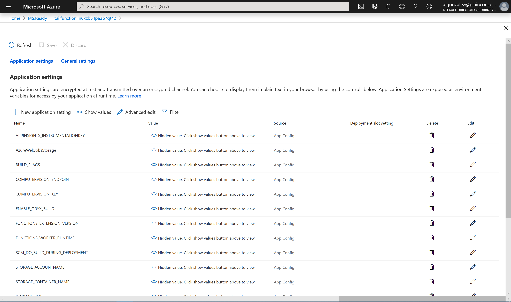
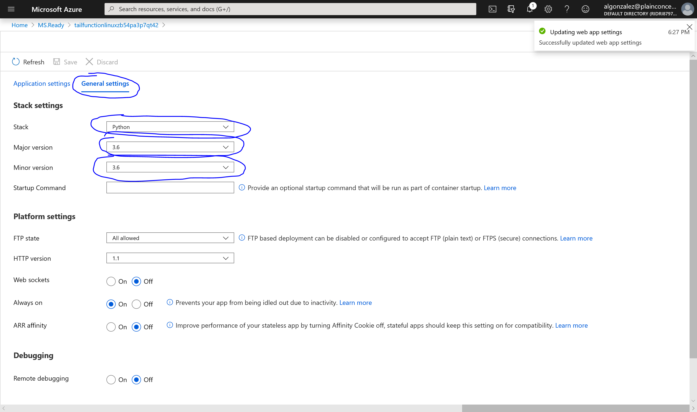
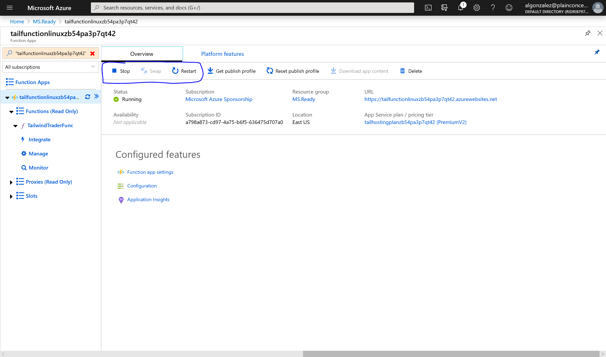
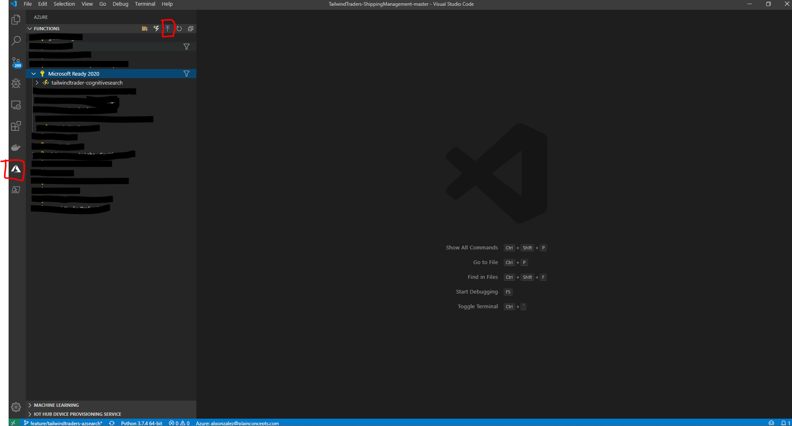
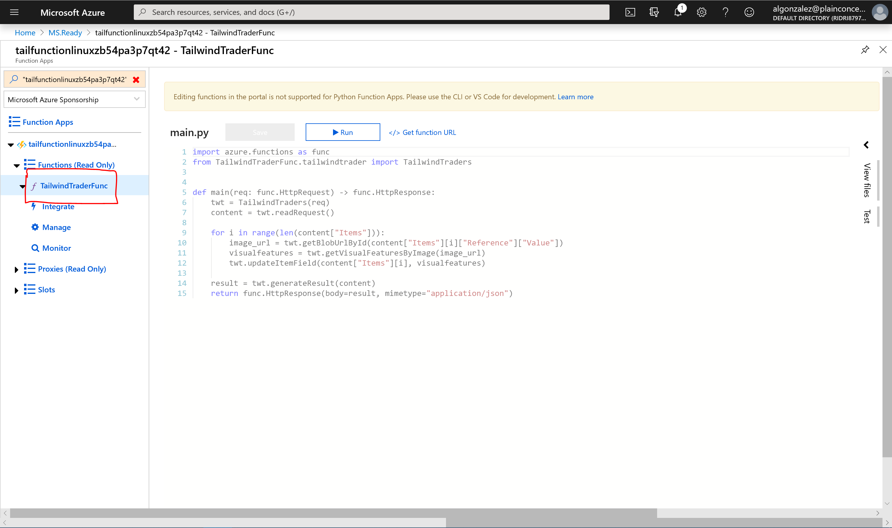

## Post-Deploy Configuration

Once the deployment of the resources has finished, you will only need to configure a few settings:

### Upload Tailwind Images Dataset to your Azure Storage

Go to your storage containers and you will see two containers that they were created by the ARM templates automatically:

1. tail-products
2. tail-trainmodel

For this step of the project, check if the deployment of the tail-products was succesfully executed.

### Set configuration settings of your Azure Function

When the Azure Function App was created there is no function on resource, you will have to configure the function app before do anything.

##### Step 1: Set settings

Before nothing you will have to set many settings in Azure Function project located on `TailwindTraders-ShippingManagement/AzSearchCustomSkillFunction/source/shared_code/config/settings.json`:
```
{
    "STORAGE_ACCOUNTNAME": "",
    "STORAGE_KEY": "",
    "STORAGE_CONTAINER_NAME": "",
    "COMPUTERVISION_KEY": "",
    "COMPUTERVISION_ENDPOINT": ""
}
```
>Note: All this settings were setted by the ARM Template in the deploy step. If you wanna to see the settings, go to your **function app** -> **Platform features** -> **Configuration**



#####  Step 2: Set Stack Runtime to Python

Go to your **function app** -> **Platform features** -> **Configuration** -> **General Settings**:



Set the stack options:

- Stack: Python
- Major version: 3.6
- Minor version: 3.6

Finally dont forget and click **Save**. Then restart the  **Stop** and  **Start** again the Function App




##### Step 3: Deploy Azure Function Code to Azure Function App

- Open your VS Code
- Install the azure function extension


- Go to the extension of **Azure Function** and **login** with your azure account which you deployed the Azure Resources by ARM Templates.



If you focus on the image you will see and **blue icon** ont the top, that the bottom to deploy your Azure Function. 

Steps when you click on the deploy button:

1. Select the folder: 

    Is really important to open your VS Code in the next directory:

    **source**->**TailwindTraders.ShippingManagement.CustomSkill**
2. Select your subscription
3. Select your Function App where you would like to deploy the code
4. Deploy!

After that, you can view in the VS Code outputs and the log of the deploy process (Press Ctrl+J and select outputs tab)
When the deploy finish go to your Azure Portal and check in your function app that the function deployed succesfully.



### Azure Search: Create Index, Indexer, skillset and datasource

When you have your function app and running you should think that actually you have a function that Azure Search Skillset can consume it (Custom SKillset).
So, how can you used it? How can we start indexing information at the Index?

##### Step 1: Execute powershell script
For this step you will need to execute powershell script on `TailwindTraders-ShippingManagement/Deploy/` folder:

```
.\DeployUnifiedAzSearch.ps1
```

- `subscriptionId`: Id of your subscription where you are going to deploy your resource group `Required`
- `subscriptionName`: Name of your subscription where you are going to deploy your resource group `Required`
- `resourceGroupName`: The name of your resource group where all infrastructure will be created `Required`
- `resourceGroupNameFunction`: The name of your resource group where your azure function was created `Required`
- `functionAppName`: The name of your function app `Required`
- `functionName`: The name of your function `Required`
- `azsearchDatasourceName`: The name of the Azure Search Datasource you want it to create `Required`
- `cosmosAccountName`: The name of your cosmos account `Required`
- `cosmosDataset`: The name of your cosmos database `Required`
- `skillsetName`: The name of the Azure Search Skillset you want it to create `Required`
- `cognitiveServiceName`: The name of your cognitive services `Required`
- `azSearchIndexName`: The name of the Azure Search Index you want it to create `Required`
- `indexerName`: The name of the Azure Search Indexer you want it to create `Required`

>Note: This file is a unified file. It will execute four powershells scripts during the execution:

    Deploy-Create-Datasource.ps1
    Deploy-Create-Skillset.ps1
    Deploy-Create-Index.ps1
    Deploy-Create-Indexer.ps1

## TO FIX:

- No init documents in the Cosmos DB, so the Azure Search Indexer wont indexing any document.