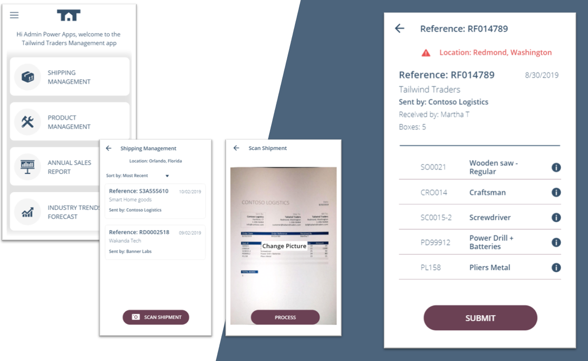

# Tailwind Traders Management App


Tailwind Traders Management App is a sample app created using Power Apps with the main goal of connect a easy creation app model to serverless solutions within [Azure](https://azure.microsoft.com/products/powerapps).
The goal of the app is to upload a packaging slip document using the Power Apps, send the image to an Azure Function and analyze the data using Form Recognizer Services. The function will return a model to the app and the final user would modify, if needed, the data received. The last step is store the data received and modified in CosmosDb using a Logic App.

# Repositories

For this demo reference, we built several consumer and line-of-business applications and a set of backend services. You can find all repositories in the following locations:

- [Tailwind Traders](https://github.com/Microsoft/TailwindTraders)
- [Backend (AKS)](https://github.com/Microsoft/TailwindTraders-Backend)
- [Website (ASP.NET & React)](https://github.com/Microsoft/TailwindTraders-Website)
- [Desktop (WinForms & WPF -.NET Core)](https://github.com/Microsoft/TailwindTraders-Desktop)
- [Rewards (ASP.NET Framework)](https://github.com/Microsoft/TailwindTraders-Rewards)
- [Mobile (Xamarin Forms 4.0)](https://github.com/Microsoft/TailwindTraders-Mobile)

# Table of contents

In this repository we will find different solutions:

- Power Apps zip package solution.
- Swagger files to configure custom connectors.
- Azure Function Code (Scan code and Custom Skill for Azure Search)
- Deploy section, containing the Deploy solution and the ARM templates of the resources used.

# Before you begin

You will need to set up some features before deploy the solution to Azure:

1. You will need an Azure Subscription in order to follow this demo script.
1. You will need a [Power Apps account](https://powerapps.microsoft.com/en-us/) with P2 license or trial. 
1. Tailwind Traders App Management source code.
1. Azure CLI. [Information](https://docs.microsoft.com/en-us/cli/azure/install-azure-cli-windows?view=azure-cli-latest).
1. PowerShell.

Additionally, in order to debug the Azure Function you will need:
1. You will need Visual Studio 2017 or later. Also, you can use VS Code if you have it.

# Deployment scenarios


## Deploy using one script
You can deploy the scenario using one script under `/Deploy` folder.
Running the following command you can deploy starting with the infrastructure and ending with deploying the images on the storage:

```
.\Deploy-Unified.ps1 -resourceGroup <resource-group-name> -location <location> -clientId <service-principal-id> -password <service-principal-password> -subscription <subscription-id> -prefixName <prefix-name>
```

- `resourceGroup`: The name of your resource group where all infrastructure will be created `Required`
- `location`: Select where you want to create your resource group. (i.e., East US) `Required`
- `subscription`: Id of your subscription where you are going to deploy your resource group `Required`
- `prefixName`: The name to refer the resources to be deployed. It will be composed with the following format: *prefixname-resourcetype-resourceGroupNameEncoded* (i.e., if you enter as a prefix name: tailwind, Azure Function resource name will become: *tailwindfunction12875156*). `Required`

The resources that will be deployed are:
- Azure Function.
- Premium Hosting Plan.
- Storage.
- Form Recognizer.
- CosmosDb.
- Logic App.
- CosmosDb connection.
- Application Insight.
- Cognitive Services
- Azure Search

The deployment will configure the logic app connection, will publish the assets for training the Form Recognizer in the storage and will deploy the Azure Function code.

## Post-Deploy Configuration

Once the deployment of the resources has finished, you will only need to configure a few settings. Following the next docs files you'll achieve the final solution:

 1. ### [Power Apps and custom connectors next steps](./Documents/docs/powerapp.md)
 2. ### [Azure Search configuration](./Documents/docs/azsearch.md)

## Contributing

This project welcomes contributions and suggestions.  Most contributions require you to agree to a
Contributor License Agreement (CLA) declaring that you have the right to, and actually do, grant us
the rights to use your contribution. For details, visit https://cla.opensource.microsoft.com.

When you submit a pull request, a CLA bot will automatically determine whether you need to provide
a CLA and decorate the PR appropriately (e.g., status check, comment). Simply follow the instructions
provided by the bot. You will only need to do this once across all repos using our CLA.

This project has adopted the [Microsoft Open Source Code of Conduct](https://opensource.microsoft.com/codeofconduct/).
For more information see the [Code of Conduct FAQ](https://opensource.microsoft.com/codeofconduct/faq/) or
contact [opencode@microsoft.com](mailto:opencode@microsoft.com) with any additional questions or comments.
